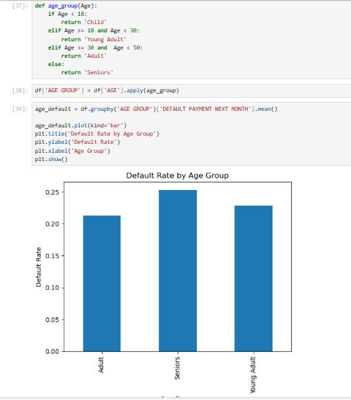
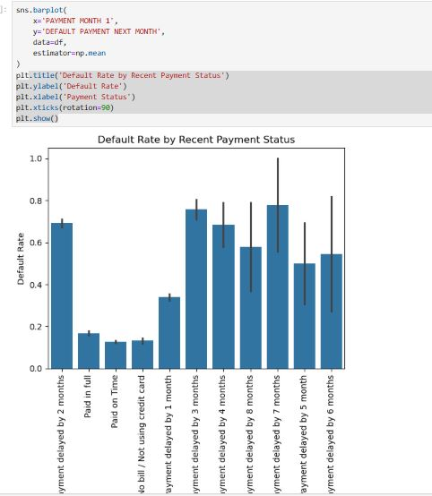
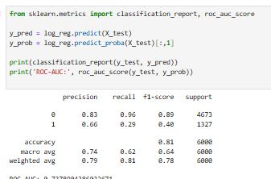

📊 Credit Card Default Risk Analysis

Objective:
To analyze customer credit card behavior and build predictive models to identify default risk using demographic, financial, and behavioral features.

📁 Dataset

Source: Default of Credit Card Clients (Taiwan)

Records: 30,000 customers

Target Variable: Default payment next month (0 = No, 1 = Yes)

🛠️ Key Steps

Data Cleaning

Handled inconsistent payment status values

Validated billing and payment amounts

Exploratory Data Analysis (EDA)

Default rate analysis

Impact of age, education, marriage, credit limit

**Default Rate by Age Group**

**Default Rate by Martial Status**

**Default Rate by Recent Payment Status**

Payment behavior & delinquency patterns

**Feature Engineering**

Delay count

Inactive months

Total bill & payment

Payment ratio

Machine Learning

Logistic Regression (baseline, interpretable)

Random Forest (non-linear relationships)

Model Evaluation

**ROC-AUC**

Precision, Recall, F1-score

Feature importance analysis

📈 Key Findings

Payment behavior is the most important predictor of default

Repeated delinquency significantly increases risk

Demographic features are secondary compared to behavioral signals

Random Forest outperformed Logistic Regression

📷 Business Visualization Preview
Business Visualization Preview

🔧 Tools & Libraries

Python, Pandas, NumPy

Matplotlib, Seaborn

👤 Author
Imran Akbar — AML & IT Project Management Professional 10+ years in Compliance, Sanctions, and Financial Crime Systems. 
🌐 LinkedIn www.linkedin.com/in/mr-imran-akbar

Scikit-learn
